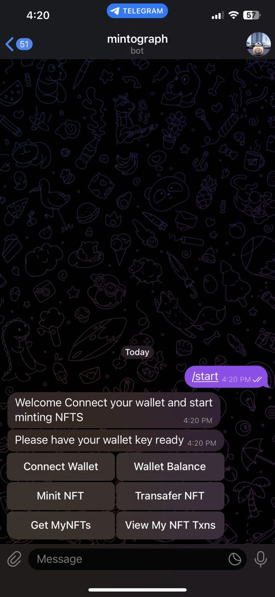

# Mintograph

Mintograph is a Telegram bot designed to simplify the process of creating and managing NFTs. The bot allows you to connect your Metamask wallet, upload an image, and instantly mint it as an NFT on the Ethereum blockchain.

## Features


- Mint your own NFTs.
- View and manage your NFTs directly through Telegram.
- Transafer NFTS to to other addresses.
- View Recent NFT Transactions.
- Get All your NFT links.

## Technologies Used

- Telegram Bot API
- Telegraf.js - Modern Telegram Bot Framework for Node.js
- Ethers.js - Complete Ethereum library and wallet implementation in JavaScript.
- Express.js - Web application framework for Node.js
- Solidity - Smart contract programming language

## Getting Started

These instructions will get you a copy of the project up and running on your local machine for development and testing purposes.

### Prerequisites

- Node.js
- npm

### Installation

1. Clone the repository
   ```sh
   git clone https://github.com/alvienzo720/mintograph

### ScreenShots



